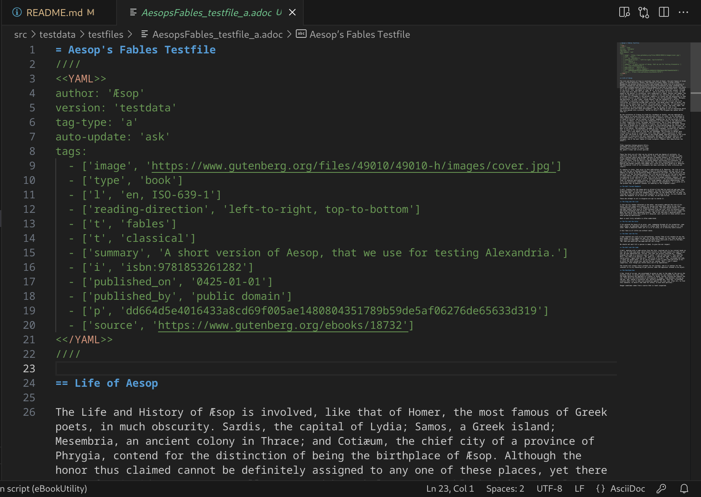
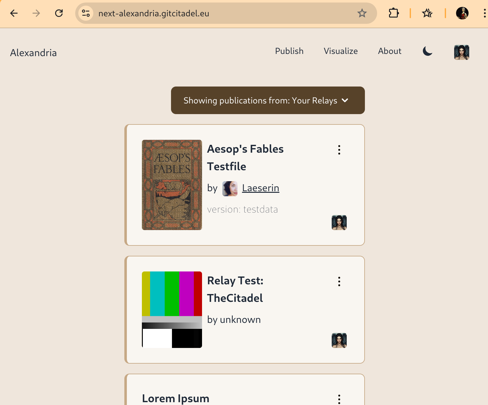
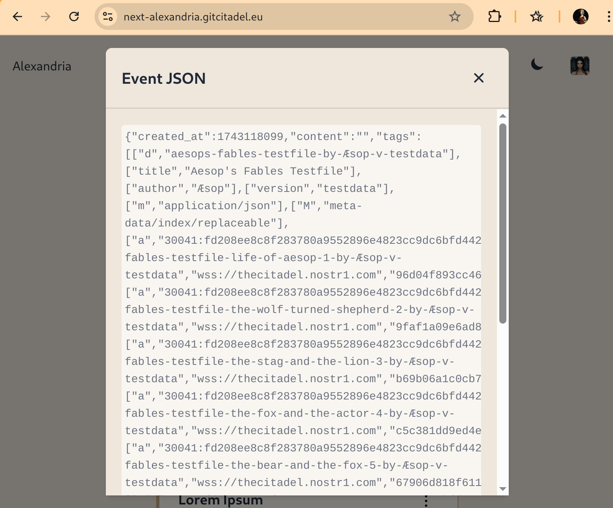
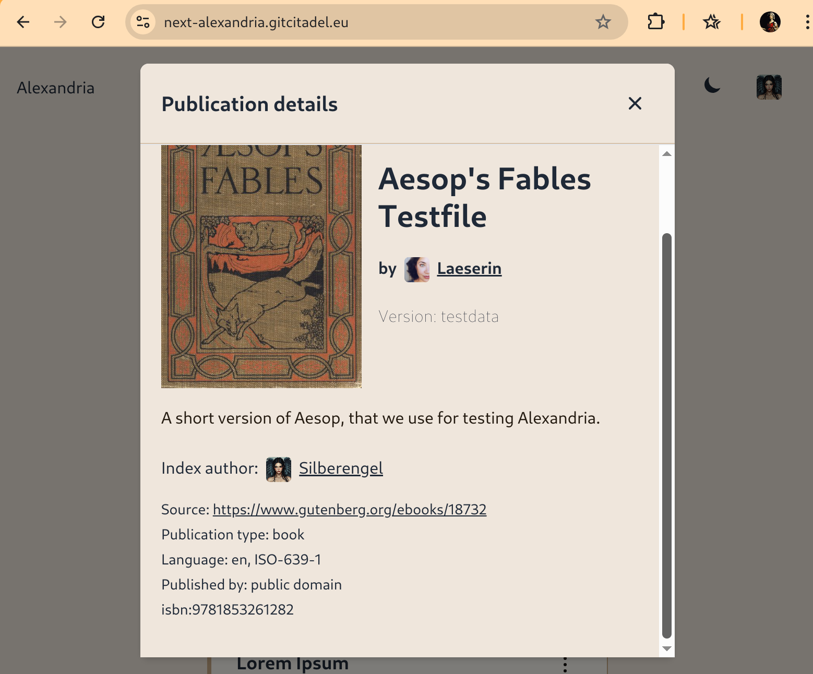
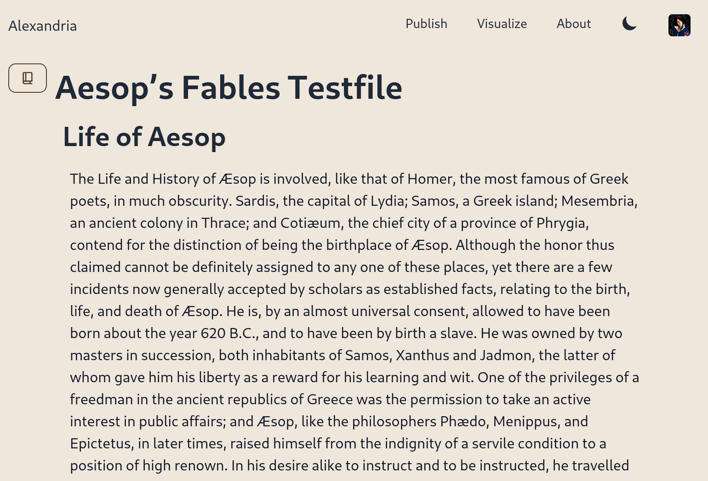

# Alexandria Upload Utility

## Description

This is a simple PHP program that takes an edited/pre-formatted Asciidoc document, splits it into the specific sections or chapters defined (based upon the first and second level headers, for further levels, please use the [Alexandria client](https://next-alexandria.gitcitadel.eu/about)), generates a [curated publication](https://next-alexandria.gitcitadel.eu/publication?d=gitcitadel-project-documentation-curated-publications-specification-7-by-stella-v-1) from that file, and writes it to the relays selected.

## Prerequisites

1. You will need to have php (including php-cli) and composer installed on the machine and configured.
2. Then run ```composer install``` to download the dependencies to a *vendor* folder and create the *composer.lock* file.
3. If you do not yet have the yaml PECL library installed, run 
```sudo apt-get install php-yaml```.
4. Then enter ```php --ini``` and look for the entry ```Loaded Configuration File``` that contains the filepath to the *php.ini* file.
5. Enter ```sudo nano <filepath>``` and add the line, at the bottom ```extension=yaml.so``` and restart the terminal.
6. If using VS Code or Codium, you will need to also go to *File > Preferences > Settings*. Search for *stubs*, click the *Edit settings in json* link, and then add *yaml* to the stubs list.

## Directions

1. Save your Bech32 nsec in the environment variable with `export NOSTR_SECRET_KEY=nsec123`.
2. Open the folder *user* and edit the file *relays.yml* containing your list of relays. We recommend keeping wss://thecitadel.nostr1.com in your list and adding at least one other, that you have write access to. If you remove all relays, the Citadel relay will be used as default. ```a``` tags will always contain thecitadel relay as the relay hint.
3. Open the file in the *user* folder called *settings_template.yml*, read the descriptions of the event tags at the top, and then copy out the `////<<YAML>>` section.
4. Paste the section beneath the document header (=) of your publication. The publication file should be located at in the top/root folder and have an `.adoc` ending.
4. Edit the information within that yaml section and remove/add any optional tags.
5. If you like, you can do the same for each 1st-level header (==). That will give the 30041 events more-customized tags. Otherwise, they derive their tags from the 30040 index event.
6. On the command line, enter the program name and the name of your publication file.

```php createPublication.php MyShortBook.adoc```

6. All of the events will be added to the *eventsCreated.txt* file.
8. The 30040 eventID will be sent to stdout (usually the command line) in the form of an njump hyperlink. The link will not work, if you wrote to a local relay, but you can still see the eventID.

## Automated Tests

To check that everything is installed correctly, you can run 

```
./vendor/bin/phpunit src/
```

to see the unit and integration tests, if you have PHPUnit installed.

## Example

If you go to [next-alexandria](https://next-alexandria.gitcitadel.eu), you can then see the publications which you have produced, so long as you have published them to [wss://thecitadel.nostr1.com](https://thecitadel.nostr1.com) or one of your npub's outbox relays.

An example of a typical document, produced with this tool, is the test file `AesopsFables_testfile_a.adoc` which looks like this:



And produces a book, like this:









## Contact information

If you have any questions, comments, or zaps, then please feel free to contact me on Nostr. My npub is [npub1l5sga6xg72phsz5422ykujprejwud075ggrr3z2hwyrfgr7eylqstegx9z](https://njump.me/npub1l5sga6xg72phsz5422ykujprejwud075ggrr3z2hwyrfgr7eylqstegx9z).